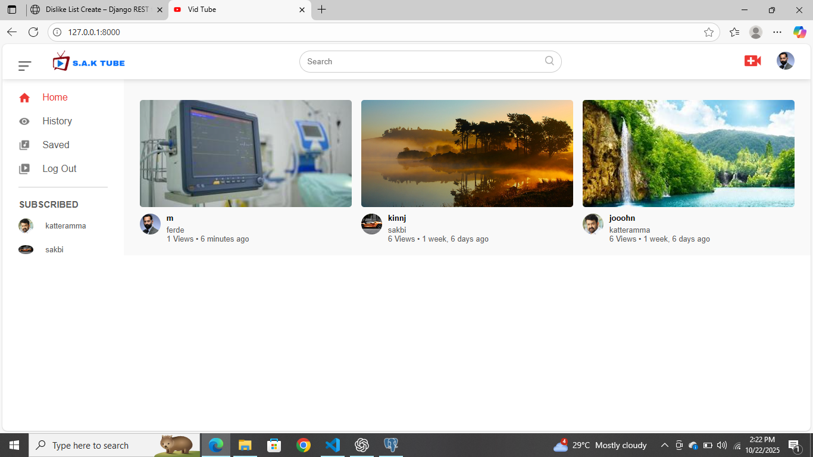

# 🎬 Social Media YouTube Clone (Django Project)

A mini YouTube-like web app built with Django REST API  
Users can upload videos, create channels, like, subscribe, and more!

---

## 🚀 Features
- User registration & login system  
- Channel creation and video uploads  
- Like / Dislike system 
- Comment system 
- Subscription functionality  
- Watch history & “Watch Later” feature  
- Search engine for videos and channels  
- Bootstrap frontend with custom CSS  

---

## 🛠️ Tech Stack
- **Backend:** DRF (Python)  
- **Frontend:** HTML, CSS, Bootstrap, JavaScript  
- **Database:** postgres  
- **Media Handling:** Django ImageField  
- **Version Control:** Git & GitHub  

---

## 🖼️ Screenshots

### Homepage

### playvideo

### editchannel

### channel

### vidupload

### register

## 🌍 Live Demo
[Click here to visit the live website](https://social-media-youtube.onrender.com)

